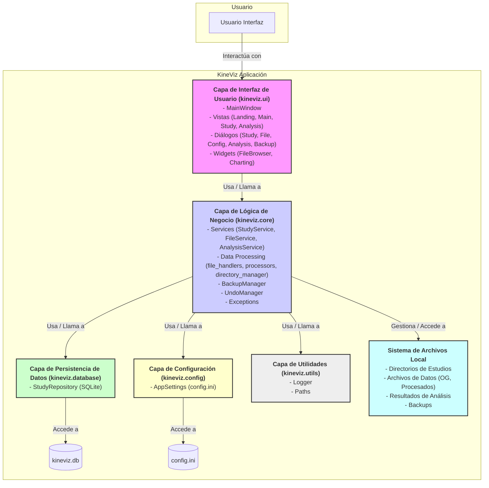

=======
# Guía para Crear Diagramas de Arquitectura Lógica y Modelo Relacional de KineViz

Este documento te ayudará a crear diagramas sencillos pero informativos para la arquitectura lógica y el modelo relacional de KineViz, basados en la documentación proporcionada.

## 1. Diagrama de Arquitectura Lógica

La arquitectura lógica de KineViz se puede representar como un diagrama de capas. El objetivo es mostrar los principales agrupamientos de módulos y cómo interactúan a un alto nivel.

**Capas Principales:**

1.  **Interfaz de Usuario (UI) (`kineviz.ui`)**: Responsable de la presentación y la interacción con el usuario.
2.  **Lógica de Negocio y Dominio (Core) (`kineviz.core`)**: El cerebro de la aplicación, contiene la lógica fundamental.
3.  **Persistencia de Datos (`kineviz.database`)**: Maneja el almacenamiento y la recuperación de datos de la base de datos.
4.  **Configuración de la Aplicación (`kineviz.config`)**: Gestiona los ajustes de la aplicación.
5.  **Utilidades Generales (`kineviz.utils`)**: Funciones de apoyo transversales.

**Cómo Dibujarlo:**

Puedes usar rectángulos apilados o adyacentes para representar las capas. Las interacciones se pueden mostrar con flechas.



**Explicación del Diagrama:**

*   **Usuario:** Interactúa directamente con la Capa de Interfaz de Usuario.
*   **Capa de Interfaz de Usuario (`kineviz.ui`):**
    *   Contiene todos los componentes visuales (ventanas, diálogos, widgets).
    *   Delega las operaciones a la capa de Lógica de Negocio.
*   **Capa de Lógica de Negocio (`kineviz.core`):**
    *   Es el núcleo. Los `Services` orquestan las operaciones.
    *   Utiliza `Data Processing` para manipular archivos y datos.
    *   `BackupManager` y `UndoManager` proporcionan funcionalidades de respaldo y deshacer.
    *   Interactúa con la `Database` para persistir metadatos de estudios.
    *   Interactúa con `Config` para leer/escribir ajustes.
    *   Gestiona la estructura de directorios y archivos en el `Sistema de Archivos Local`.
    *   Utiliza `Utils` para logging y gestión de rutas.
*   **Capa de Persistencia de Datos (`kineviz.database`):**
    *   `StudyRepository` abstrae el acceso a la base de datos SQLite (`kineviz.db`).
*   **Capa de Configuración (`kineviz.config`):**
    *   `AppSettings` maneja el archivo `config.ini`.
*   **Capa de Utilidades (`kineviz.utils`):**
    *   Proporciona funcionalidades comunes como logging.
*   **Sistema de Archivos Local:**
    *   No es una capa de código, pero es crucial. Almacena los datos de estudios, archivos procesados, resultados de análisis, la base de datos SQLite y el archivo de configuración.

Este diagrama muestra una clara separación de responsabilidades y el flujo general de control y datos.

## 2. Diagrama de Modelo Relacional (Conceptual)

Dado que KineViz utiliza una única tabla SQL principal (`estudios`) y maneja mucha información estructural a través de campos JSON y el sistema de archivos, el diagrama del modelo relacional será "conceptual" para reflejar esta realidad.

**Entidad Principal (Tabla SQL):**

*   **`estudios`**

**Atributos de la Tabla `estudios`:**

*   `id_estudio` (INTEGER, PK) - Clave Primaria
*   `nombre_estudio` (TEXT, UNIQUE) - Nombre único del estudio
*   `num_participantes` (INTEGER) - Número de participantes
*   `cantidad_intentos_prueba` (INTEGER) - Número de intentos por prueba/condición
*   `independent_variables` (TEXT) - Almacena JSON con la definición de VIs y sub-valores
*   `aliases` (TEXT) - Almacena JSON con el mapeo de sub-valores a alias
*   `is_pinned` (INTEGER) - Indicador de estudio fijado (0 o 1)
*   `comentario` (TEXT) - Comentarios sobre el estudio

**Entidades Conceptuales (No son tablas SQL separadas):**

*   **Estructura JSON de `independent_variables`**:
    *   Contiene una lista de objetos, cada uno representando una VI.
    *   Cada VI tiene: `name` (str), `descriptors` (list[str]), `allows_combination` (bool), `is_mandatory` (bool).
*   **Estructura JSON de `aliases`**:
    *   Un diccionario donde las claves son sub-valores originales y los valores son sus alias.
*   **Sistema de Archivos del Estudio**:
    *   Estructura de carpetas jerárquica basada en `nombre_estudio` e `ID_Participante`.
    *   Contiene archivos de datos (originales, procesados), resultados de análisis.
    *   Los nombres de archivo codifican `ID_Participante` y sub-valores de VIs.

**Cómo Dibujarlo:**

Puedes usar un rectángulo para la tabla `estudios` y listar sus atributos. Luego, usa notas o recuadros conectados para explicar el contenido de los campos JSON y la relación con el sistema de archivos.

```mermaid
erDiagram
    estudios {
        INTEGER id_estudio PK "Clave Primaria"
        TEXT nombre_estudio UK "Nombre único del estudio"
        INTEGER num_participantes
        INTEGER cantidad_intentos_prueba
        TEXT independent_variables "JSON: [{name, descriptors[], allows_combination, is_mandatory}, ...]"
        TEXT aliases "JSON: {sub_valor_original: alias_descriptivo, ...}"
        INTEGER is_pinned
        TEXT comentario
    }

    %% Entidades Conceptuales y Relaciones
    %% No son tablas SQL, sino representaciones de cómo se usa la información

    estudios ||--o{ "Sistema de Archivos del Estudio" : "Organizado en / Contiene"
    note for "Sistema de Archivos del Estudio" {
        "Estructura de Carpetas:"
        "- estudios/[nombre_estudio]/"
        "- .../[ID_PARTICIPANTE]/OG/"
        "- .../[ID_PARTICIPANTE]/[TIPO_DATO]/"
        "- .../Analisis Discreto/"
        "- .../Analisis Continuo/"
        "Nombres de Archivo:"
        "- P01_CMJ_PRE_01.txt (validados vs VIs)"
    }

    estudios }|..| "Definición de VIs (en independent_variables)" : "Contiene estructura de"
    note for "Definición de VIs (en independent_variables)" {
        "Ejemplo de estructura JSON:"
        "[{\"name\": \"TipoSalto\", \"descriptors\": [\"CMJ\", \"SJ\"]}, ...]"
        "Usado por FileService y AnalysisService para validación y agrupación."
    }

    estudios }|..| "Mapeo de Alias (en aliases)" : "Contiene estructura de"
    note for "Mapeo de Alias (en aliases)" {
        "Ejemplo de estructura JSON:"
        "{\"CMJ\": \"Salto Contra Movimiento\", \"PRE\": \"Antes\"}"
        "Usado por UI para mostrar nombres descriptivos."
    }

    %% No hay relaciones de clave foránea tradicionales a otras tablas SQL
    %% porque no existen para estas entidades conceptuales.
```

**Explicación del Diagrama:**

*   **Tabla `estudios`:** Es el centro. Sus atributos SQL están listados.
*   **`independent_variables` (Campo JSON):**
    *   Una nota explica que este campo TEXT contiene una estructura JSON.
    *   Se indica que esta estructura define las Variables Independientes (VIs), sus sub-valores y propiedades.
    *   Conceptualmente, la tabla `estudios` "contiene" esta definición.
*   **`aliases` (Campo JSON):**
    *   Similarmente, una nota explica que este campo TEXT contiene un JSON para los alias.
    *   Conceptualmente, la tabla `estudios` "contiene" estos mapeos.
*   **Sistema de Archivos del Estudio (Entidad Conceptual):**
    *   Se representa como una entidad relacionada con `estudios`. La relación es "Organizado en / Contiene".
    *   Una nota describe la estructura de carpetas clave (basada en `nombre_estudio` de la tabla `estudios`) y cómo los nombres de archivo se relacionan con las VIs.
    *   Esta relación no es una clave foránea SQL, sino una dependencia lógica y organizativa gestionada por la aplicación (`FileService`, `StudyService`).

**Conexiones y Cardinalidad:**

*   **`estudios` y `Sistema de Archivos del Estudio`**: Un estudio (`estudios`) tiene asociado un conjunto de directorios y archivos en el sistema de archivos. Podría considerarse una relación uno-a-uno (un registro de estudio corresponde a una estructura de directorio principal del estudio).
*   **`estudios` y `independent_variables` / `aliases`**: Un estudio tiene una definición de VIs y un conjunto de alias. Es una relación uno-a-uno donde los datos estructurados están embebidos dentro del registro del estudio.

Este modelo relacional conceptual es fiel al diseño de KineViz, mostrando que la base de datos SQL es simple, pero se complementa con datos semi-estructurados (JSON) y la organización del sistema de archivos para manejar la complejidad total de la información del estudio.